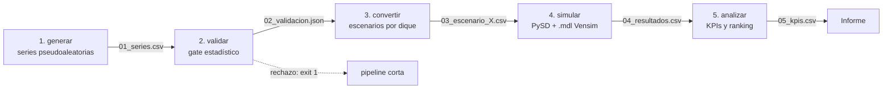

# Optimización de Distribución Hídrica en Mendoza

Proyecto final de Simulación. Combina **generación de números pseudoaleatorios validados estadísticamente** (Unidad 5) con un **modelo de dinámica de sistemas construido en Vensim** (4 embalses: Potrerillos, El Carrizal, El Nihuil y Agua del Toro), ejecutado desde Python con [PySD](https://pysd.readthedocs.io). El objetivo: analizar cómo usar de forma óptima el agua de la provincia balanceando riego agrícola y generación hidroeléctrica.

## Arquitectura: pipeline batch por artefactos

El proyecto sigue el patrón **Pipes & Filters** con núcleo funcional puro (*functional core, imperative shell*). Cada fase es un comando independiente que lee y escribe artefactos en disco; las fases no se importan entre sí, solo comparten **contratos de datos** (esquemas CSV).



La fase 2 es un **quality gate**: si los números generados no superan los tests (Chi-cuadrada, Kolmogorov-Smirnov), el pipeline se detiene y nunca se simula con datos inválidos.

### Estructura del código

```
src/simulador/
├── core/                  # Núcleo funcional PURO (sin I/O, sin prints)
│   ├── generacion.py      #   distribuciones climáticas (Gamma, Normal)
│   ├── estadistica.py     #   tests de hipótesis (gate de la Unidad 5)
│   ├── conversion.py      #   física: mm y m³/s → hm³/mes + estacionalidad
│   └── kpis.py            #   indicadores y score multiobjetivo
├── persistencia/          # Shell imperativo: I/O
│   ├── esquemas.py        #   contratos de los CSV (única fuente de verdad)
│   └── repositorio.py     #   RepositorioArtefactos + ManifestCorrida
├── fases/                 # Filters del pipeline (artefacto → artefacto)
│   ├── generar.py         #   Fase 1
│   ├── validar.py         #   Fase 2 (gate)
│   ├── convertir.py       #   Fase 3 (asignaciones registradas acá)
│   ├── simular.py         #   Fase 4 (ÚNICO módulo que importa pysd)
│   └── analizar.py        #   Fase 5
├── cli.py                 # argparse con subcomandos
├── config.py              # ConfigPipeline + ConfigDique (los 4 diques)
│
├── aggregate.py           # [legacy] orquestador simulación por eventos
├── embalse.py             # [legacy] simulador discreto (Unidad 4)
├── aleatorios.py          # [legacy] generador original
└── models.py / util.py    # dataclasses y helpers compartidos

modeloDinamico/
└── ProyectoGlobalSimulacion(PrimerModeloTerminado).mdl   # modelo Vensim
tests/
└── test_core.py           # tests unitarios del núcleo funcional
artefactos/                # corridas (se crea al ejecutar; no versionar)
```

## Instalación

Requiere Python ≥ 3.12 y [uv](https://docs.astral.sh/uv/).

```bash
uv sync          # instala dependencias (incluye pysd) y el paquete
```

## Uso

### Pipeline completo (recomendado)

```bash
uv run simular pipeline --seed 100 --anios 500
```

Corre las 5 fases encadenadas y deja los artefactos en `artefactos/{id_corrida}/`.

Opciones disponibles para reproducir los escenarios del informe:
- `--anios 500` (años generados, usar 500 para mayor potencia estadística)
- `--asignacion uniforme|estacional` (política de erogación)
- `--escenario normal|crisis|sequia_total|el_nino` (régimen climático)
- `--horizonte-meses 120` (debe coincidir con el FINAL TIME del `.mdl`)

#### Tabla de Comandos para los 8 Escenarios Evaluados

Para reproducir exactamente los 8 escenarios que nutren las conclusiones del informe, podés copiar y pegar los siguientes comandos. Todos utilizan 500 años y la semilla 100 para garantizar la validación estadística y la consistencia de los datos.

| Régimen Climático | Asignación Temporal | Comando a ejecutar |
| :--- | :--- | :--- |
| **Normal** | Uniforme | `uv run simular pipeline --seed 100 --anios 500 --escenario normal --asignacion uniforme` |
| **Normal** | Estacional | `uv run simular pipeline --seed 100 --anios 500 --escenario normal --asignacion estacional` |
| **El Niño** | Uniforme | `uv run simular pipeline --seed 100 --anios 500 --escenario el_nino --asignacion uniforme` |
| **El Niño** | Estacional | `uv run simular pipeline --seed 100 --anios 500 --escenario el_nino --asignacion estacional` |
| **Crisis Hídrica** | Uniforme | `uv run simular pipeline --seed 100 --anios 500 --escenario crisis --asignacion uniforme` |
| **Crisis Hídrica** | Estacional | `uv run simular pipeline --seed 100 --anios 500 --escenario crisis --asignacion estacional` |
| **Sequía Total** | Uniforme | `uv run simular pipeline --seed 100 --anios 500 --escenario sequia_total --asignacion uniforme` |
| **Sequía Total** | Estacional | `uv run simular pipeline --seed 100 --anios 500 --escenario sequia_total --asignacion estacional` |

*Luego de correr los escenarios que desees, podés ejecutar `uv run simular analizar --todas` para generar el `ranking_global.csv`.*

### Fases individuales

Cada fase se puede correr (y re-correr) por separado. `--corrida ultima` (default) apunta a la corrida más reciente:

```bash
uv run simular generar --seed 7 --anios 500
uv run simular validar --corrida ultima          # exit 1 si el gate rechaza
uv run simular convertir --corrida ultima --asignacion estacional
uv run simular simular --corrida ultima
uv run simular analizar --corrida ultima
```

### Comparación de políticas (ranking global)

```bash
uv run simular analizar --todas
```

Consolida los KPIs de todas las corridas, calcula el score multiobjetivo y escribe `artefactos/ranking_global.csv`:

```
score = 0.5 · satisfacción_riego + 0.3 · energía_normalizada − 0.2 · fracción_meses_crisis
```

(Pesos configurables en `ConfigPipeline.pesos_score`.)

### Monte Carlo

Las corridas son directorios aislados y las fases procesos sin estado compartido, así que paralelizar es trivial:

```bash
seq 1 100 | xargs -P 8 -I{} uv run simular pipeline --seed {}
uv run simular analizar --todas
```

### Simulador legacy (Unidad 4)

La simulación discreta por eventos original sigue disponible:

```bash
uv run simular eventos
```

### Tests

```bash
uv run pytest tests/ -q
```

## Artefactos de una corrida

| Artefacto | Fase | Contenido |
|---|---|---|
| `manifest.json` | todas | seed, config, hash del `.mdl`, versión de PySD (reproducibilidad) |
| `01_series_climaticas.csv` | generar | una fila por (año, mes): precipitación, fusión, afluente, demanda, temperatura |
| `02_validacion.json` | validar | resultado de cada test estadístico y veredicto del gate |
| `03_escenario_{dique}.csv` | convertir | `mes, entrada_agua_hm3, temperatura_c` por embalse |
| `04_resultados_pysd.csv` | simular | series mensuales del modelo Vensim (KPIs y volúmenes) |
| `05_kpis.csv` | analizar | indicadores agregados de la corrida |

El manifest evoluciona con el pipeline: cada fase agrega sus metadatos. El hash del `.mdl` detecta si el modelo cambió entre fases.

## Integración con el modelo Vensim

### Cómo se inyectan los números generados

El `.mdl` define las entradas de agua con `WITH LOOKUP` (valores históricos fijos). PySD permite **pisar esas variables sin modificar el archivo Vensim**, pasando series temporales por `params`:

```python
modelo.run(params={
    "Entrada Agua Potrerillos": serie_potrerillos,   # pd.Series indexada por mes
    "Nihuil Entrada Agua": serie_nihuil,
    "Carrizal Entrada Agua": serie_carrizal,
    "Agua Del Toro Entrada Agua": serie_agua_del_toro,
    "Temperatura Actual": serie_temperatura,
}, final_time=120)
```

PySD interpola linealmente entre puntos. La traducción `.mdl → .py` se cachea junto al modelo (`modeloDinamico/*.py`) y se regenera solo si el `.mdl` cambia.

### Conversión física

Por cada mes: `volumen [hm³] = (lluvia_mm + nieve_mm)/1000 · área_cuenca + caudal_m3s · segundos_mes`, sobre un área total de 5.600 km². El volumen total se reparte entre los diques según proporciones calibradas contra los lookups originales del `.mdl`:

| Dique | Variable Vensim | Proporción |
|---|---|---|
| Potrerillos | `Entrada Agua Potrerillos` | 0.55 |
| Agua del Toro | `Agua Del Toro Entrada Agua` | 0.18 |
| El Nihuil | `Nihuil Entrada Agua` | 0.15 |
| El Carrizal | `Carrizal Entrada Agua` | 0.12 |

Se configuran en `DIQUES_MENDOZA` (`src/simulador/config.py`).

### Estrategias de asignación

| Estrategia | Lluvia/nieve | Afluente |
|---|---|---|
| `uniforme` | repartidas parejo en 12 meses | como se generó |
| `estacional` | pesos mendocinos (deshielo pica dic–feb) | modulado por estacionalidad |

Agregar una estrategia nueva = una función más en el registro `ASIGNACIONES` de `fases/convertir.py` (principio abierto/cerrado: no se toca nada más).

## Decisiones de diseño

- **Pipes & Filters + artefactos**: cada unidad de la materia mapea 1:1 con una fase y deja evidencia inspeccionable para el informe.
- **Functional core, imperative shell**: `core/` es puro y testeable sin mocks; todo el I/O vive en `persistencia/` y `fases/`.
- **PySD aislado**: solo `fases/simular.py` lo importa; cambiar de motor toca un único archivo.
- **Chi-cuadrada contra Gamma con bins equiprobables**: bondad de ajuste correcta (frecuencia esperada uniforme por cuantiles de la distribución ajustada), con grados de libertad descontando los parámetros estimados.
- **El CSV como contrato**: los comentarios del `.mdl` ya preveían que la entrada "viene del CSV de Python". Si mañana se quiere correr en Vensim nativo, el mismo `03_escenario_*.csv` puede consumirse con `GET DIRECT DATA`.

## KPIs del análisis

Tomados directamente del modelo de dinámica de sistemas:

| KPI | Variable Vensim | Interpretación |
|---|---|---|
| Satisfacción de riego | `Total Satisfaccion Riego` | impacto social/agrícola (1.0 = demanda cubierta) |
| Energía generada | `Total Energia GWh` | impacto económico |
| Ingresos | `Total Ingresos Energia` | USD por venta de energía |
| Llenado del sistema | `Total Porcentaje de Llenado Completo` | < 0.30 crisis, 0.30–0.50 alerta |
| Satisfacción por dique | `{Dique} Satisfaccion Riego` | detalle territorial |

## Solución de problemas

- **El gate rechaza** (`exit 1` en `validar`): revisar `02_validacion.json`; con `n_anios` chicos (< 100) los tests pierden potencia. Usar 500.
- **`KeyError` de variables en `simular`**: los nombres de `ConfigDique.variable_entrada` deben coincidir EXACTO con el `.mdl`. La fase valida contra `model.doc` y lista las desconocidas.
- **Cambiaste el `.mdl`**: la traducción se regenera sola (compara mtime). El hash en el manifest registra con qué versión del modelo corrió cada corrida.
- **`horizonte_meses` > FINAL TIME del `.mdl`**: PySD corre hasta `final_time` igual; mantené ambos en 120 o ajustá los dos.
